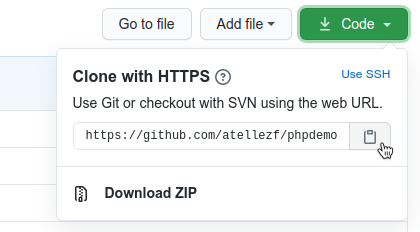

# PHPDemo
> Proyecto de la materia Desarrollo e integración de aplicaciones y servicios web  
- - - -
### OPCIÓN #1: Descarga en formato zip
* Para descargarlo en formato zip, puedes hacerlo mediante el botón ::Clone or Download::,.


- - - -
### OPCIÓN #2: Descarga mediante git clone
* Si tienes instalado [git](https://git-scm.com), como control de versiones en tu equipo de desarrollo,
```
$ git clone https://github.com/atellezf/phpdemo.git
Cloning into 'phpdemo'...
remote: Counting objects: 52, done.
remote: Compressing objects: 100% (22/22), done.
remote: Total 52 (delta 5), reused 31 (delta 5), pack-reused 20
Unpacking objects: 100% (52/52), done.
$
```
- - - -
### INSTALACIÓN DE DEPENDENCIAS EN PROYECTO FINAL
* Para trabajar con el proyecto final,  deberás tener instalado [composer](https://getcomposer.org/) como manejador de paquetes php.
```
$ cd phpdemo/proyecto/
$ composer install
Loading composer repositories with package information
Installing dependencies (including require-dev) from lock file
Package operations: 2 installs, 0 updates, 0 removals
  - Installing psr/log (1.0.2): Loading from cache
  - Installing monolog/monolog (1.23.0): Loading from cache
...
$ php -S localhost:8080 -t public
```
